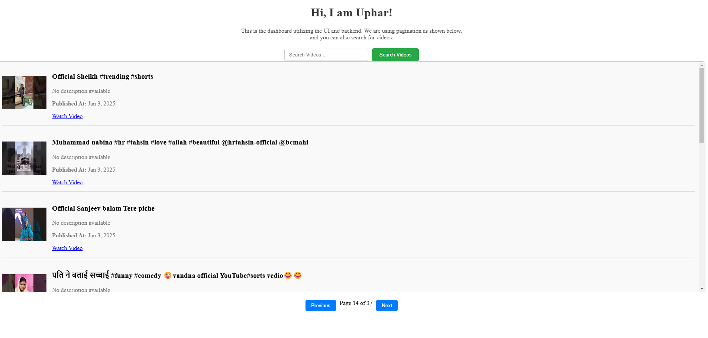
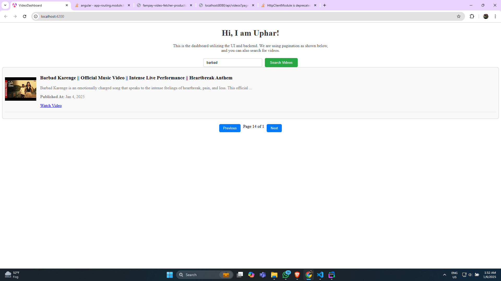

# FamPay Backend Assignment

Backend assignment for FamPay internship by Uphar gaur

## Overview

A RESTful API service that fetches data from YouTube APIs and stores them in a database. The service periodically fetches data from the YouTube API in an async way and stores it in the database. The service also provides APIs to retrieve and search through the stored videos.

## Tech Stack

- **Language**: Go
- **Database**: MongoDB
- **APIs**: YouTube Data API v3
- **Deployment**: Docker, Railway
- **Frontend**: Angular (coming soon)
- **Frontend Deployment**: Vercel (coming soon)

# Important Links 🔗

- **Backend Deployment**: [Live API](https://fampay-video-fetcher-production.up.railway.app/api/videos?page=2)
    - Access the live API to fetch paginated video data
    - Test the search functionality and explore the endpoints

- **Backend Repository**: [GitHub Repo](https://github.com/uphargaur/fampay-video-fetcher)
    - View the source code
    - Clone the repository for local development
    - Check out the documentation and contribute

- **YouTube Demo**: Coming Soon
    - Watch a comprehensive walkthrough of the application
    - Learn about the features and implementation details

- **Frontend Repository**: [GitHub Repo](https://github.com/uphargaur/Video-dashboard)
    - Angular-based frontend codebase
    - User interface for video browsing and searching
    - Modern, responsive design implementation

- **Frontend Deployment**: Coming Soon
    - Live demo of the frontend application on Vercel
    - Interactive interface for exploring the video data
    - Seamless integration with the backend API

## API Quick Links 🚀

- **Get Videos**: `GET /api/videos?page={page_number}`
    - Example: [Get Page 2](https://fampay-video-fetcher-production.up.railway.app/api/videos?page=2)

- **Search Videos**: `GET /api/videos/search?q={search_term}`
    - Replace [search q = Sorry](https://fampay-video-fetcher-production.up.railway.app/api/search?orderBy=channel_name&q=Sorry)

## Features Implemented ✅

### Core Features:

1. **Background YouTube API Data Fetching**:
    - Continuous fetching of latest videos from YouTube API
    - Configurable fetch interval (default: 10 seconds)
    - Data stored in MongoDB Atlas with proper indexing
    - Stored fields include:
        - Video title
        - Description
        - Publishing datetime
        - Thumbnail URLs
        - Additional metadata

2. **GET Paginated API**:
    - Retrieves stored video data with pagination
    - Sorted in descending order by publishing datetime
    - Configurable page size and number

3. **Search API**:
    - Search functionality for videos
    - Supports title and description search
    - Partial matching capability

4. **Dockerized Application**:
    - Complete Docker configuration
    - Includes `Dockerfile` and `docker-compose.yml`
    - Easy deployment and scaling

5. **Scalable and Optimized Architecture**:
    - Efficient API key rotation system
    - Optimized database queries
    - Proper error handling and logging

### Bonus Features 🌟

1. **Advanced API Key Rotation**:
    - Automatic switching between multiple API keys
    - Handles quota exhaustion gracefully
    - Even distribution of API usage
   
2. **Enhanced Search Capabilities**:
    - Optimized search performance

3. **Dashboard UI** (Coming Soon):
    - Angular-based frontend interface
    - Features:
        - Video browsing with filters
        - Sorting options
        - Search functionality
        - Responsive design
    - Will be deployed on Vercel


## Frontend Development (Coming Soon)

The frontend application is being developed using Angular and will feature:

1. **Modern UI/UX**:
    - Responsive design
    - Material Design components

**Pagination Demo**


    

**Search Demo**




## System Design

### Architecture
```
+----------------+     +-----------------+     +------------------+
|                |     |                 |     |                  |
| YouTube API v3 | --> | Go Application  | --> | MongoDB Database |
|                |     |                 |     |                  |
+----------------+     +-----------------+     +------------------+
                             |
                             |
                      +----------------+
                      |   REST APIs    |
                      +----------------+
```

### Database Schema

```go
type Video struct {
    ID              primitive.ObjectID `bson:"_id,omitempty"`
    VideoID         string            `bson:"videoId"`
    Title           string            `bson:"title"`
    Description     string            `bson:"description"`
    PublishedAt     time.Time         `bson:"publishedAt"`
    ThumbnailURL    string            `bson:"thumbnailUrl"`
    CreatedAt       time.Time         `bson:"createdAt"`
}
```

## API Documentation

### Get Videos API

```http
GET /api/videos
```

Query Parameters:
- `page` (optional): Page number for pagination (default: 1)
- `limit` (optional): Number of videos per page (default: 10)

Response:
```json
{
    "status": "success",
    "data": {
        "videos": [
            {
                "videoId": "string",
                "title": "string",
                "description": "string",
                "publishedAt": "datetime",
                "thumbnailUrl": "string"
            }
        ],
        "pagination": {
            "currentPage": 1,
            "totalPages": 10,
            "totalVideos": 100
        }
    }
}
```

### Search Videos API

```http
GET /api/videos/search?q=query
```

Query Parameters:
- `q`: Search query string
- `page` (optional): Page number for pagination (default: 1)
- `limit` (optional): Number of videos per page (default: 10)

Response:
```json
{
    "status": "success",
    "data": {
        "videos": [
            {
                "videoId": "string",
                "title": "string",
                "description": "string",
                "publishedAt": "datetime",
                "thumbnailUrl": "string"
            }
        ],
        "pagination": {
            "currentPage": 1,
            "totalPages": 10,
            "totalVideos": 100
        }
    }
}
```

## Setup Guide

### Prerequisites

Before proceeding with the setup, ensure you have:

- [Git](https://git-scm.com/)
- [Docker](https://docs.docker.com/get-docker/)
- [GoLang](https://golang.org/dl/) (if running outside Docker)
- MongoDB Atlas account
- [Postman](https://www.postman.com/) (for testing)

### Installation Steps

1. Clone the repository:
```bash
git clone https://github.com/yourusername/FamPay-Assignment.git
cd FamPay-Assignment
```

2. Set up MongoDB Atlas:
    - Create a MongoDB Atlas account
    - Create a new cluster
    - Create a database user with read/write privileges
    - Get the connection string URI

3. Configure environment variables:
```bash
cp .env.example .env
```

Edit `.env` with your details:
```env
# MongoDB connection URI
MONGODB_URI=mongodb+srv://<username>:<password>@cluster0.mongodb.net/<database>?retryWrites=true&w=majority

# YouTube API Keys (comma-separated)
YOUTUBE_API_KEYS=key1,key2,key3

# Application Settings
SEARCH_QUERY=official
POLL_INTERVAL=10
PORT=8080
```

### Running the Application

#### Using Docker (Recommended)

1. Build and start containers:
```bash
docker-compose up --build
```

2. Access the application at `http://localhost:8080`

#### Local Development

1. Install dependencies:
```bash
go mod tidy
```

2. Run the application:
```bash
go run cmd/main.go
```

## Project Structure

```
.
├── cmd/
│   └── main.go
├── internal/
│   ├── api/
│   │   └── handlers/
│   ├── config/
│   ├── models/
│   ├── repository/
│   ├── service/
│   └── utils/
├── pkg/
│   └── youtube/
├── .env.example
├── .gitignore
├── docker-compose.yml
├── Dockerfile
├── go.mod
├── go.sum
└── README.md
```

## Development

### Adding New Features

1. Create a new branch:
```bash
git checkout -b feature/your-feature-name
```

2. Make your changes
3. Run tests:
```bash
go test ./...
```

4. Submit a pull request

### Code Style

- Follow Go best practices and idioms
- Use meaningful variable and function names
- Add comments for complex logic
- Keep functions small and focused

## Testing

Run all tests:
```bash
go test ./... -v
```

Run specific test:
```bash
go test ./internal/service -v
```

## Deployment

The application is deployed on Railway. The deployment process is automated through GitHub Actions.

### Manual Deployment

1. Build the Docker image:
```bash
docker build -t fampay-assignment .
```

2. Push to container registry:
```bash
docker push your-registry/fampay-assignment
```

## Contributing

1. Fork the repository
2. Create your feature branch
3. Commit your changes
4. Push to the branch
5. Create a Pull Request

## License

This project is licensed under the MIT License - see the LICENSE file for details.

## Contact

- Author: Uphar Gaur
- Email: uphargaur@gmail.com
- GitHub: [@uphargaur](https://github.com/uphargaur/)
- portfolio- [uphargaur](https://uphar.codersborn.today/)

## Acknowledgments

- FamPay for the opportunity
- YouTube Data API documentation
- Go community for excellent packages